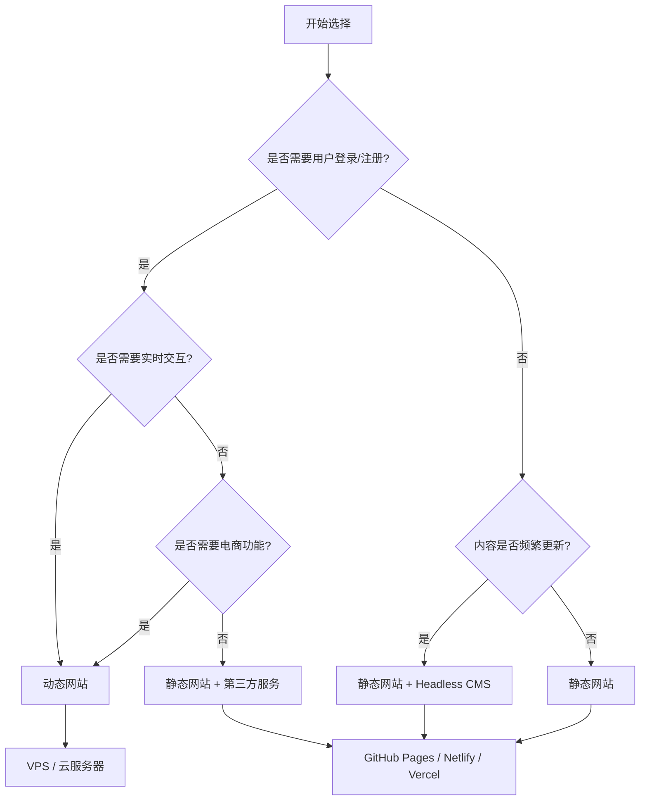

# 静态网站 vs 动态网站：如何选择？

在开始建站之前，首先要回答一个问题：**选择静态网站还是动态网站？**

这个选择直接影响到网站的性能、成本、安全性、可维护性以及 SEO 表现。本文将从多个维度全面对比两种架构，帮助您做出明智的决策。

## 一、什么是静态网站？

静态网站由预先生成的 HTML 文件组成，每个页面都是一个独立的 HTML 文件。用户访问时，服务器直接返回这些文件，无需任何后端处理。

**典型技术栈：**
- 静态站点生成器：Hugo、Jekyll、Next.js（SSG）、Gatsby
- 托管平台：GitHub Pages、Netlify、Vercel、Cloudflare Pages
- 内容来源：Markdown 文件、Headless CMS

**特点：**
- 页面在构建时生成，访问时直接返回
- 无需数据库和服务端运行时
- 部署即生效

## 二、什么是动态网站？

动态网站在用户访问时实时生成页面，服务器需要执行后端代码、查询数据库、渲染模板，然后将结果返回给用户。

**典型技术栈：**
- 后端语言：PHP、Python（Django/Flask）、Node.js、Java（Spring）、Ruby on Rails
- 数据库：MySQL、PostgreSQL、MongoDB
- CMS：WordPress、Drupal、Strapi

**特点：**
- 页面在请求时实时生成
- 依赖数据库和服务器端代码
- 支持用户登录、评论、购物车等交互

## 三、核心维度对比

### 3.1 性能与加载速度

| 维度 | 静态网站 | 动态网站 |
|------|----------|----------|
| 页面加载时间 | 极快（< 1 秒） | 较慢（需查询数据库、渲染） |
| 并发处理能力 | 极高（CDN 原生支持） | 受服务器资源限制 |
| 缓存策略 | 强缓存，边缘节点分发 | 需要 Redis 等缓存层 |
| 首屏加载 | 直接返回完整 HTML | 需要等待后端响应 |

**结论**：静态网站在速度上有绝对优势。53% 的用户会放弃加载超过 3 秒的网站，静态网站能显著降低跳出率。

### 3.2 成本

| 维度 | 静态网站 | 动态网站 |
|------|----------|----------|
| 服务器成本 | 极低（可免费托管） | 较高（需要 VPS 或云服务器） |
| 数据库成本 | 无 | 需要数据库实例 |
| 运维成本 | 极低（无需维护后端环境） | 较高（需要安全补丁、性能调优） |
| 开发成本 | 中等（需要熟悉 SSG） | 较高（前后端开发、数据库设计） |

**结论**：静态网站的总体成本显著低于动态网站，尤其是长期维护成本。

### 3.3 安全性

| 维度 | 静态网站 | 动态网站 |
|------|----------|----------|
| 攻击面 | 极小（无数据库、无后端代码） | 较大（SQL 注入、XSS、CSRF 等） |
| 数据泄露风险 | 极低 | 较高（数据库泄露风险） |
| 安全更新 | 无需 | 需要定期更新框架和依赖 |

**结论**：静态网站天生更安全，无需担心服务器被入侵、数据库泄露等问题。

### 3.4 SEO 友好度

| 维度 | 静态网站 | 动态网站 |
|------|----------|----------|
| 页面速度 | ✅ 极快，加分 | ❌ 较慢，扣分 |
| HTML 结构 | ✅ 清晰简洁 | ⚠️ 可能有多余代码 |
| 结构化数据 | ✅ 易于实现 | ✅ 可以实现 |
| 移动端适配 | ✅ 灵活可控 | ✅ 灵活可控 |

**结论**：静态网站在 SEO 上有天然优势，Google 明确将页面速度作为排名因素。

### 3.5 功能与交互能力

| 维度 | 静态网站 | 动态网站 |
|------|----------|----------|
| 用户登录 | 需要第三方服务（Auth0、Firebase） | ✅ 原生支持 |
| 评论系统 | 需要第三方（Disqus、Giscus） | ✅ 原生支持 |
| 电子商务 | 需要第三方（Snipcart、Shopify） | ✅ 原生支持 |
| 实时数据 | 需要前端调用 API | ✅ 原生支持 |
| 内容管理 | 需要 Git + Markdown 或 Headless CMS | ✅ 原生 CMS |

**结论**：如果需要复杂用户交互和实时数据，动态网站更合适。

### 3.6 维护与更新

| 维度 | 静态网站 | 动态网站 |
|------|----------|----------|
| 内容更新 | 修改 Markdown 文件 → 重新构建 → 部署 | 登录 CMS 后台编辑即可 |
| 技术维护 | 极低 | 较高（服务器运维、安全补丁） |
| 部署流程 | 简单（Git push 自动部署） | 复杂（需要 CI/CD 或手动部署） |

**结论**：静态网站的维护成本远低于动态网站。

## 四、适用场景对比

### 静态网站最适合：

- ✅ 企业官网、品牌展示站
- ✅ 个人博客、技术文档
- ✅ 学术网站、研究项目展示
- ✅ 作品集、个人品牌站
- ✅ 营销落地页、活动页面
- ✅ 产品文档、用户手册

### 动态网站最适合：

- ✅ 电商网站（需购物车、支付）
- ✅ 社交平台（需用户登录、互动）
- ✅ 论坛、社区（需用户内容）
- ✅ SaaS 应用（需用户管理、订阅）
- ✅ 内部管理系统（需权限控制）

## 五、决策流程图

## 六、混合方案：Jamstack

Jamstack 是一种现代化的架构模式，将静态网站与动态功能结合：

- **静态部分**：使用 SSG 生成页面
- **动态部分**：通过 API 调用实现功能
- **好处**：兼顾静态网站的性能和动态网站的交互能力

**示例：**
- 评论：使用 Giscus 或 Disqus
- 搜索：使用 Algolia 或 Meilisearch
- 登录：使用 Auth0 或 Supabase
- 电商：使用 Snipcart 或 Shopify 的 Buy Button

## 七、选择建议

| 您的需求 | 推荐方案 |
|----------|----------|
| 只是展示信息，没有用户交互 | ✅ 静态网站 |
| 需要快速上线，预算有限 | ✅ 静态网站 |
| 非常重视 SEO | ✅ 静态网站 |
| 需要用户登录和会员功能 | ⚠️ 静态 + 第三方 或 动态 |
| 需要复杂的电商功能 | ❌ 动态网站 |
| 需要实时聊天、通知 | ❌ 动态网站 |
| 内容由非技术人员管理 | ⚠️ 静态 + Headless CMS |

## 八、总结

静态网站和动态网站各有优势，选择哪种架构取决于您的具体需求：

- **大多数展示型网站（企业官网、个人博客、学术网站）**：静态网站是最佳选择。速度更快、成本更低、更安全。
- **需要复杂交互的网站（电商、社交、SaaS）**：动态网站是必要的。
- **介于两者之间的需求**：可以考虑 Jamstack 混合方案。

如果您正在规划一个新的网站项目，建议优先考虑静态网站方案。它不仅能满足大多数展示型需求，还能为未来的扩展打下良好基础。

---

*不确定哪种方案适合您？cancms 提供专业的网站架构咨询和建站服务，欢迎 [联系我们](/contact/) 了解更多。*
